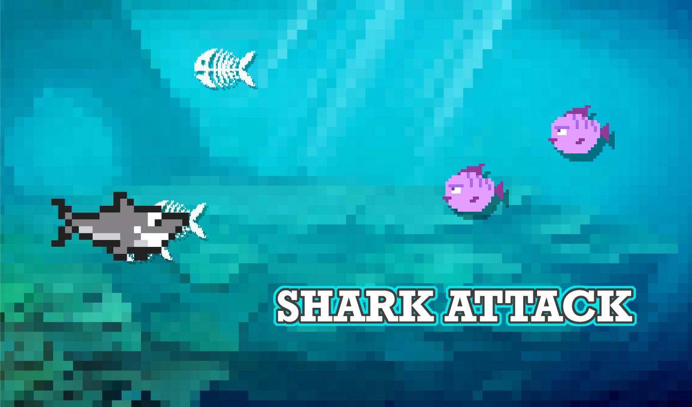

# CMTTHE04 Week3 oefening 1

Startproject voor Shark Attack in Typescript 🦈

 
 

## Creëer de vissen 🐠

Bestudeer de opzet van het project. In de create functie wordt een HTML-element voor de vis aangemaakt en deze wordt op een random plek in het scherm gezet. 
Met `Math.random() * window.innerWidth` wordt een random x aangemaakt over de breedte van het scherm. Hier wordt de breedte van de vis (`this.div.clientWidth`) vanaf gehaald zodat de niet buiten het scherm kan vallen. `Math.floor()` rondt een decimale waarde af naar beneden.
- Genereer een random `x` en `y`

 
 

## Beweeg de vissen 🐠

In de update functie van de vis komt de code te staan om de vis te verplaatsen. 

- Haal van de `y` een waarde af (3) zodat de vis naar links zal verplaatsen.
- Log de waarde van de `y` variabelen in de console.
- Gebruik de variabelen om de vis op die plek te tekenen!

 
 

## Het scherm in en uit zwemmen 🐠

Om te controleren of de vis het scherm is uitgezwommen hebben we de breedte van het scherm nodig. Dit kan je opvragen met: `window.innerWidth`. Als de `x` van de vis plus de beedte van de vis `this.div.clientWidth` kleiner is dan 0, dan is de vis links het scherm uitgezwommen en plaatsen we deze weer aan de rechterkant (op een random hoogte)

- Check of de vis (op de x-as) links het scherm is uitgegaan.
- Plaats de vis op de x-as net buiten het scherm `window.innerWidth`
- Geef de vis op de y-as een random waarde, net als in de create functie

 
 

## Meerdere vissen 🐠🐠

- Maak een array voor de vissen in Game.ts: `fish : Fish[] = []`. Vergeet niet een lege array toe te kennen aan de variabele
- Plaats een aantal vissen in de array met `this.fish.push(new Fish())`. Experimenteer met het aantal vissen. Hier kan je ook een loop voor gebruiken.
- Update alle vissen in de gameloop van game.ts. Ook hier heb je een (`for...of`) loop voor nodig

 
 

## SHARK!!! 🦈

- Het project bevat een `shark.ts` class. Werk de create functie verder uit. De x van de haai staat standaard op 100. De y is een random waarde binnen het scherm (net als bij de vis)
- Voeg een haai instance toe aan Game.ts!
- Vergeet niet de haai te updaten, net zoals de vissen.

 
 

## Beweeg de haai 🦈

Voor het bewegen van de haai gebruiken we het toetsenbord. We gaan hiervoor luisteren naar de "ArrowUp" en "ArrowDown" op het toetsenbord. Hiervoor voegen we eventListeners toe als de haai wordt aangemaakt (in constructor van de haai). Wanneer een knop wordt ingedrukt op het toetsenbord zal de functie `onKeyDown` worden uitgevoerd. 

In de functie kan je via `e.key` achterhalen om welke knop op het toetsenbord het ging. Vervolgens kennen we een snelheid toe.

- Bestudeer het [voorbeeld van keyboard input](https://github.com/HR-CMGT/Typescript/blob/master/snippets/movement.md)
- log de ingedrukte knop in de console.
- Laat de haai omhoog en omlaag bewegen.

 
 

## Haai 🦈 eet vis 🐠

Als we willen dat een haai een vis kan opeten, moeten we eerst controleren of de haai over de vis gezwommen is. Dit doen we dmv collision detection.Bestudeer het [voorbeeld van collision detection](https://github.com/HR-CMGT/Typescript/blob/master/snippets/collision.md)
- Voeg in game.ts collision detection toe tussen de vissen en de haai. 
- Toon een bericht in de console als een vis de haai raakt.
- Verander het uiterlijk van de vis naar graatjes net als in de eerste opdracht.

 
 

## Multiplayer

- Kan je twee haaien toevoegen die elk hun eigen keyboard controls hebben? 

 
 

## Voorbeeldcode

- [Collision detection](https://github.com/HR-CMGT/Typescript/blob/master/snippets/collision.md)
- [Keyboard input](https://github.com/HR-CMGT/Typescript/blob/master/snippets/movement.md)
- [Game Loop](https://github.com/HR-CMGT/Typescript/blob/master/snippets/game.md)
