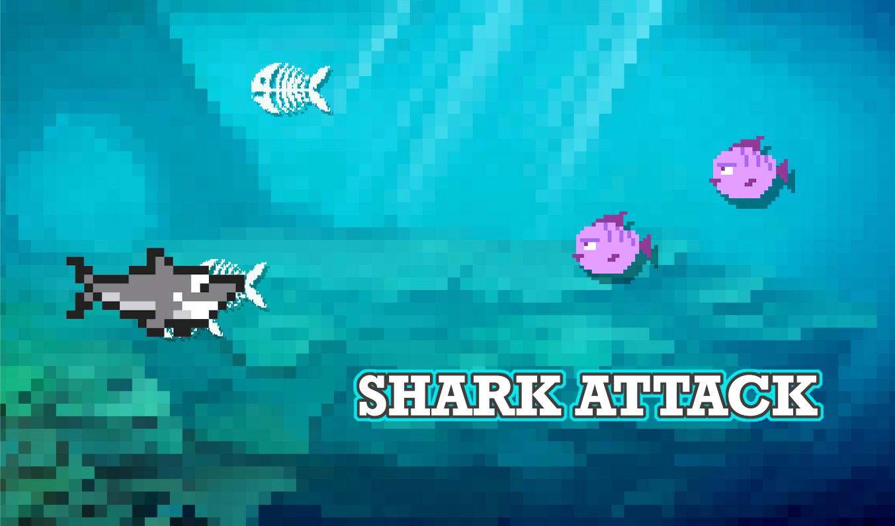
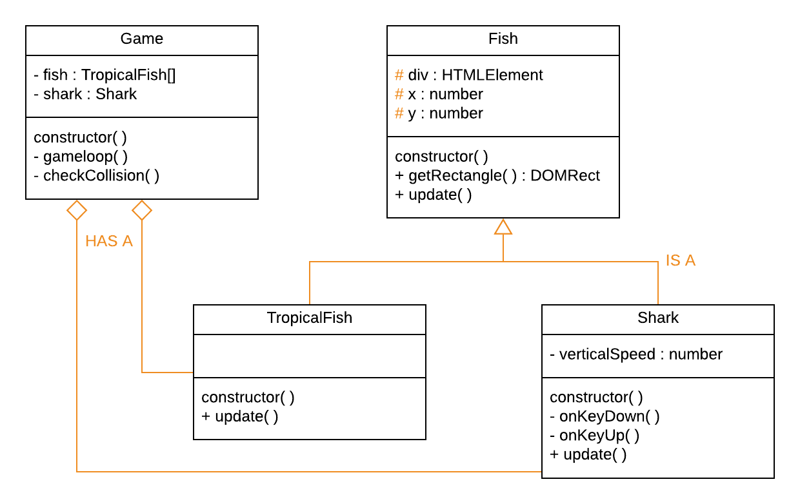

# CMTTHE04 Week 5 

Shark Attack in Typescript 🦈


<br>
<br>

## Klassendiagram


## Opdracht

Gebruik inheritance om de **overeenkomstige eigenschappen** én de **overeenkomstige functies** van *TropicalFish* en *Shark* in een *Fish* class te plaatsen. 

**Fish**
```
class Fish {
    constructor() {
        console.log("I am a Fish")
    }
}
```

## Opdracht

TropicalFish en Shark erven van Fish en krijgen daardoor automatisch de properties en methods van Fish. Gebruik `extends` en `super()` om te overerven. Je kan `private` in de parent veranderen in `protected` (Encapsulation).

```
class TropicalFish extends Fish {
    constructor() {
        super()
    }
}
```
## Opdracht

Als een functie in een child dezelfde naam heeft als een functie in de parent, dan wordt alleen de functie van het child uitgevoerd. Als je ook de update functie van de parent wil blijven gebruiken dan kan je dat doen met `super.update()`

Kan je dit principe toepassen in Pong?

```
class Fish {
    public update() : void {
        console.log("Fish is updating!")
    }
}
class TropicalFish extends Fish {
    public update() : void {
        super.update()
        console.log("TropicalFish is updating!")
    }
}
```

## Opdracht

Maak de game helemaal af met:

- Multiplayer. Twee (of meer) Sharks met eigen controls.
- Score per player bijhouden.
- Oplopende moeilijkheidsgraad naar mate de score hoger wordt (bv. snellere TropicalFishes, of meer TropicalFishes).
- Voeg nog andere soorten Fish toe met ander gedrag.
